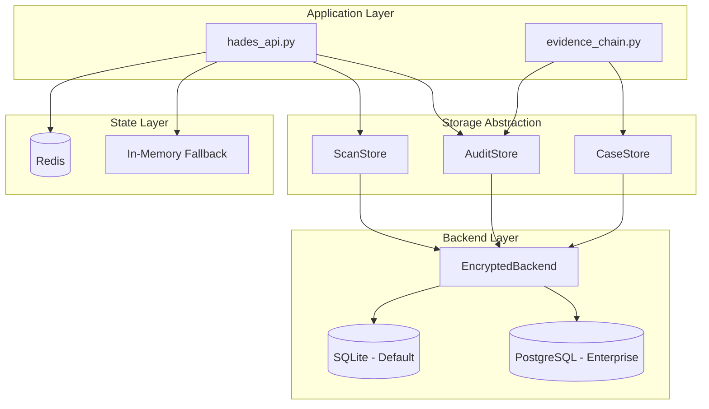
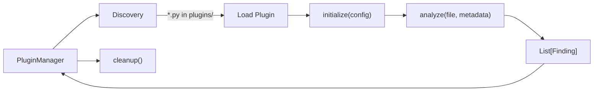
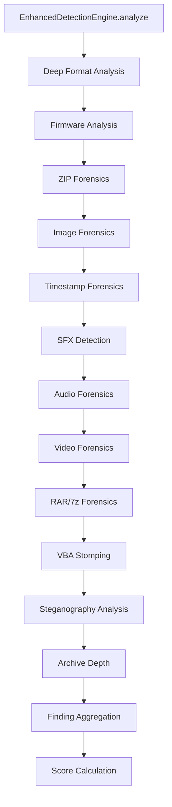

# Architecture

This document describes the system architecture of HADES, including the module dependency graph, scan pipeline, storage architecture, and API design.

## High-Level Architecture

```mermaid
graph TB
    subgraph "Entry Points"
        CLI[CLI - hades_cli.py]
        ECLI[Enhanced CLI - hades_enhanced_cli.py]
        API[REST API - hades_api.py]
        DASH[Web Dashboard - dashboard/]
    end

    subgraph "Core Detection"
        EXIF[ExifScanner - corescanner.py]
        EDE[EnhancedDetectionEngine - enhanced_detection_engine.py]
        YARA[YARA Rules - rules/]
        DFA[DeepFormatAnalyzer - deep_format_analyzer.py]
        ML[MLDetectionEngine - ml_detection.py]
        ENS[EnsembleDetector - ml_ensemble.py]
    end

    subgraph "Forensic Analyzers"
        FW[FirmwareAnalyzer - firmware_analyzer.py]
        ZIP[ZIPForensics - zip_forensics.py]
        IMG[ImageForensics - image_forensics.py]
        TS[TimestampForensics - timestamp_forensics.py]
        SFX[SFXDetector - sfx_detector.py]
        AUD[AudioForensics - audio_forensics.py]
        VID[VideoForensics - video_forensics.py]
        RAR[RARForensics - rar7z_forensics.py]
        VBA[VBAStomping - vba_stomping.py]
        STEG[SteganographyAnalyzer - stego_analyzer.py]
        ADEPTH[ArchiveDepth - archive_depth_analyzer.py]
    end

    subgraph "Enrichment"
        TI[ThreatIntelManager - cloud_threat_intel.py]
        MITRE[MITREMapper - mitre_mapping.py]
        BEH[CampaignDetector - behavioral_analysis.py]
        PLUGIN[PluginManager - plugin_api.py]
    end

    subgraph "Output"
        REP[Reporter - advanced_reporting.py]
        SIEM[SIEMIntegration - siem_integration.py]
        EVID[EvidenceChain - evidence_chain.py]
    end

    subgraph "Storage"
        DB[(Database - SQLite/PostgreSQL)]
        REDIS[(Redis - State/Cache)]
        FS[File System - Logs/Models]
    end

    subgraph "Enterprise"
        AUTH[RBAC/SSO - auth/]
        ENC[Encryption - storage/encryption.py]
        TENANT[Multi-Tenant - storage/tenant.py]
    end

    CLI --> EXIF
    ECLI --> EDE
    API --> EDE
    DASH --> API

    EDE --> EXIF
    EDE --> YARA
    EDE --> DFA
    EDE --> ML
    EDE --> ENS
    EDE --> TI
    EDE --> MITRE
    EDE --> BEH
    EDE --> PLUGIN
    EDE --> FW
    EDE --> ZIP
    EDE --> IMG
    EDE --> TS
    EDE --> SFX
    EDE --> AUD
    EDE --> VID
    EDE --> RAR
    EDE --> VBA
    EDE --> STEG
    EDE --> ADEPTH

    EDE --> REP
    EDE --> SIEM
    API --> EVID

    API --> DB
    API --> REDIS
    EVID --> DB
    AUTH --> DB
    ENC --> DB
    TENANT --> DB
    ML --> FS
```

---

## Module Dependency Graph

### Core Modules

| Module | Depends On | Exports |
|---|---|---|
| `metadata_parser_engine.py` | Pillow, PyExifTool | `HADESMetadataParser`, `MetadataAnalysisResult`, `MetadataField`, `FileForensics` |
| `enhanced_detection_engine.py` | `metadata_parser_engine`, yara-python (optional) | `EnhancedDetectionEngine`, `EnhancedDetectionResult` |
| `deep_format_analyzer.py` | pikepdf (optional), olefile (optional) | `DeepFormatAnalyzer`, `PDFAnalyzer`, `OfficeAnalyzer`, `PolyglotDetector`, `SVGAnalyzer` |
| `ml_detection.py` | scikit-learn (optional), numpy | `MLDetectionEngine`, `MetadataFeatureExtractor`, `AnomalyDetector` |
| `ml_ensemble.py` | scikit-learn (optional), xgboost (optional) | `EnsembleAnomalyDetector`, `ExtendedFeatureExtractor`, `LabeledDataManager` |
| `behavioral_analysis.py` | None | `CampaignDetector`, `FileRelationshipGraph` |
| `mitre_mapping.py` | None | `MITREMapper` |
| `cloud_threat_intel.py` | requests | `ThreatIntelManager`, provider classes |
| `plugin_api.py` | None | `HADESPlugin`, `Finding`, `PluginManager` |
| `siem_integration.py` | None | `SIEMFormatter`, `SIEMForwarder` |
| `evidence_chain.py` | None | `AuditLog`, `CaseManager`, `EvidenceExporter`, `ReportSigner` |
| `firmware_analyzer.py` | None | `FirmwareFormatAnalyzer` |
| `zip_forensics.py` | None | `ZIPForensicsAnalyzer` |
| `image_forensics.py` | None | `ImageForensicsAnalyzer` |
| `timestamp_forensics.py` | None | `TimestampForensicsAnalyzer` |
| `sfx_detector.py` | None | `SFXDetector` |
| `audio_forensics.py` | None | `AudioForensicsAnalyzer` |
| `video_forensics.py` | None | `VideoForensicsAnalyzer` |
| `rar7z_forensics.py` | None | `RAR7zForensicsAnalyzer` |
| `vba_stomping.py` | None | `VBAStompingDetector` |
| `stego_analyzer.py` | None | `SteganographyAnalyzer` |
| `archive_depth_analyzer.py` | None | `ArchiveDepthAnalyzer` |
| `security_middleware.py` | None | Rate limiter, validators, middleware, homoglyph detection |

### Integration Modules

| Module | Depends On | Exports |
|---|---|---|
| `network_connector.py` | watchdog (optional) | `NetworkFileConnector`, `ZeekConnector`, `SuricataConnector` |
| `email_gateway.py` | aiosmtpd (optional) | `EmailGateway` |
| `cloud_storage.py` | boto3/gcs/azure (optional) | `CloudStorageScanner` |
| `cicd_scanner.py` | None | `CICDScanner` |
| `chat_bot.py` | slack-bolt/botbuilder (optional) | `SlackBot`, `TeamsBot` |

### Enterprise Modules

| Module | Depends On | Exports |
|---|---|---|
| `auth/rbac.py` | bcrypt, PyJWT | `UserManager`, `get_current_user`, `require_role` |
| `auth/sso.py` | PyJWT | `OIDCProvider`, `SAMLProvider` |
| `auth/license.py` | None | `LicenseManager`, `require_license` |
| `storage/database.py` | psycopg2 (optional) | `DatabaseBackend`, `SQLiteBackend`, `PostgresBackend` |
| `storage/redis_state.py` | redis (optional) | `RedisStateManager` |
| `storage/encryption.py` | cryptography | `EncryptionManager`, `EncryptedDatabaseBackend` |
| `storage/tenant.py` | None | `TenantManager`, `TenantContext` |

---

## Scan Pipeline

The detection pipeline processes each file through multiple stages. Each stage is optional and degrades gracefully if its dependencies are not available.

### Stage Details

1. **Metadata Extraction**: `HADESMetadataParser` extracts metadata using Pillow (EXIF, XMP) and ExifTool (all formats). Produces `MetadataAnalysisResult`.

2. **YARA Pattern Matching**: Compiled YARA rules from `rules/` are matched against file content. Produces rule match findings with severity.

3. **Heuristic Analysis**: Pattern-based analysis for Base64 content, script tags, SQL injection, command injection, URL/IP extraction. Built into `EnhancedDetectionEngine`.

4. **IOC Matching**: Extracted indicators (hashes, URLs, IPs) compared against IOC databases. Produces IOC match findings.

5. **ML Anomaly Detection**: `MetadataFeatureExtractor` computes a 15-25 feature vector; `AnomalyDetector` or `EnsembleAnomalyDetector` scores it. Produces anomaly results with contributing features.

6. **Deep Format Analysis**: `DeepFormatAnalyzer` natively parses PDF, Office, SVG, and polyglot files. Produces format-specific findings.

7. **Forensic Analysis Pipeline**: Twelve specialized analyzers run in sequence, each targeting a specific file format or threat class. See [Forensic Analysis Pipeline](#forensic-analysis-pipeline) below for full details.

8. **MITRE ATT&CK Mapping**: `MITREMapper` annotates findings with MITRE technique IDs and tactics.

9. **Threat Intel Enrichment**: `ThreatIntelManager` looks up extracted indicators against cloud providers. Produces consensus verdicts.

10. **Behavioral Correlation**: `CampaignDetector` correlates findings across files to identify campaigns.

11. **Plugin Execution**: `PluginManager` runs all loaded plugins. Each plugin produces `Finding` instances.

12. **Score Aggregation**: All findings are combined into a single threat score (0-100) and threat level.

---

## Storage Architecture

- **Default**: SQLite with WAL mode (single-file, zero-config)
- **Enterprise**: PostgreSQL with connection pooling
- **Encryption**: Optional AES-256-GCM field-level encryption wraps any backend
- **Redis**: Distributed rate limiting, sessions, pub/sub, caching. Falls back to in-memory when unavailable.

---

## API Architecture

The REST API is built on FastAPI with:

- **`create_app()` factory**: Initializes the application, registers routes, wires middleware
- **Pydantic models**: Request/response validation and serialization
- **APIRouter**: Modular route registration for each feature area
- **Depends()**: Dependency injection for authentication, rate limiting, validation
- **WebSocket**: Real-time client notifications via `WebSocketManager`

### Route Groups

| Prefix | Module | Purpose |
|---|---|---|
| `/api/v1/` | `hades_api.py` | Core scanning, health, rules, plugins |
| `/api/v1/evidence/` | `evidence_api_endpoints.py` | Audit log, cases, evidence export |
| `/api/v1/auth/` | `auth/auth_routes.py` | Login, user CRUD, SSO, license |
| `/api/v1/admin/` | `storage/storage_routes.py` | Database, Redis, encryption, tenants |
| `/api/v1/integrations/` | `integrations/*_routes.py` | Network, email, cloud, CI/CD, chat |
| `/api/v1/mitre/` | `mitre_mapping.py` | ATT&CK matrix, technique lookup |
| `/api/v1/behavioral/` | `behavioral_analysis.py` | Campaign detection |
| `/api/v1/rules/` | `yara_rule_builder.py` | Rule templates, rule building |
| `/api/v1/ml/` | `ml_detection.py`, `ml_ensemble.py` | ML status, retrain, features |
| `/dashboard/` | `dashboard/` | Static SPA files |
| `/ws` | `hades_api.py` | WebSocket endpoint |

---

## Plugin Architecture

Plugins are isolated:

- Each `analyze()` call runs in a thread with a configurable timeout
- Exceptions are caught and logged; they never propagate to the caller
- Per-plugin metrics track call count, findings, errors, and average execution time

---

## Forensic Analysis Pipeline

The forensic analysis pipeline consists of 12 specialized analyzers wired into `EnhancedDetectionEngine.analyze()`. Each analyzer is a profiled analysis stage that runs after the deep format analysis pass and before MITRE ATT&CK mapping.

All forensic analyzers follow a uniform design contract:

- **Optional import with availability flag**: Each module is imported with `try/except` and exposes an `*_AVAILABLE` boolean. If the module is missing, the stage is silently skipped.
- **Common signature**: Every analyzer accepts `(file_path: str, file_data: bytes)` and returns `List[FormatFinding]`.
- **Zero external dependencies**: All analyzers use Python stdlib only, ensuring they work in any environment without additional installs.
- **Profiled execution**: Each stage is wrapped in the pipeline profiler for bottleneck analysis and performance tracing.

### Analyzer Reference

| # | Analyzer | Module | Coverage |
|---|----------|--------|----------|
| 1 | **Deep Format Analysis** | `deep_format_analyzer.py` | PDF (JS, OpenAction, embedded files, SubmitForm), Office (macros, OLE, DDE, template injection), SVG (script, XXE, event handlers, foreignObject), polyglot detection (multi-format files) |
| 2 | **Firmware Analysis** | `firmware_analyzer.py` | UEFI capsules, SPI flash images, BIOS updates, wiper malware (9 families), firmware flashing tools, bootloader artifacts (BlackLotus indicators), BadUSB/DuckyScript payloads, firmware polyglots |
| 3 | **ZIP Forensics** | `zip_forensics.py` | Zombie ZIP entries, ZIP concatenation attacks, ZIP bombs (compression ratio analysis), CRC32 mismatches, structural anomalies, local/central directory inconsistencies |
| 4 | **Image Forensics** | `image_forensics.py` | Decompression bombs (pixel count analysis), malicious ICC color profiles, thumbnail/main image mismatches, TIFF IFD chain walking, GIF frame injection, oversized image dimensions |
| 5 | **Timestamp Forensics** | `timestamp_forensics.py` | Timestamp stomping detection (create/modify/access inconsistencies), impossible dates (pre-epoch, far future), zeroed timestamps, timezone anomalies |
| 6 | **SFX Detection** | `sfx_detector.py` | Self-extracting archives: PE (MZ header) + embedded ZIP/RAR/7z, ELF + embedded archives, Mach-O + embedded archives, stub size analysis |
| 7 | **Audio Forensics** | `audio_forensics.py` | ID3v1/ID3v2 tag analysis, WAV chunk validation, OGG/Vorbis page structure, FLAC metadata blocks, M4A/AAC atom parsing, hidden data in padding |
| 8 | **Video Forensics** | `video_forensics.py` | MKV/WebM EBML structure validation, MP4/MOV atom parsing, AVI RIFF chunk analysis, FLV tag inspection, container metadata anomalies |
| 9 | **RAR/7z Forensics** | `rar7z_forensics.py` | RAR5 and RAR4 signature validation, 7z header structure analysis, archive comment inspection, encryption flag detection, solid archive analysis |
| 10 | **VBA Stomping** | `vba_stomping.py` | Source code vs. p-code mismatch detection in Office macro documents, indicating the displayed VBA source differs from the compiled bytecode that actually executes |
| 11 | **Steganography Analysis** | `stego_analyzer.py` | JPEG DCT coefficient analysis (LSB anomalies), palette-based steganography in indexed images, EOF appended data detection, tool artifact signatures (steghide, OpenStego, etc.) |
| 12 | **Archive Depth** | `archive_depth_analyzer.py` | Nested archive bomb detection (recursive depth tracking), cross-format nesting (ZIP inside RAR inside 7z), configurable depth limits, decompression ratio analysis |

### Pipeline Integration

Each analyzer contributes `FormatFinding` instances that are merged into the main findings list. Findings carry severity scores that feed into the final threat score aggregation.

---

## Security Middleware Enhancements

`security_middleware.py` provides reusable security primitives used across the API and detection layers. Recent additions include:

- **Unicode homoglyph detection**: Identifies 39 confusable character substitutions (e.g., Cyrillic `а` for Latin `a`) and 15 bidirectional control characters (RLO, LRO, PDF, etc.) commonly used in filename spoofing and display-layer attacks.
- **MIME/extension/magic consistency validation**: Cross-checks the declared MIME type, file extension, and magic byte signature to detect mismatches that indicate file type masquerading.
- **Script encoding trick detection**: Identifies encoding-based evasion techniques used to bypass content filters.

These checks complement the existing rate limiting, path traversal protection, upload validation, output sanitization, and security header middleware.

---

## YARA Rule Repository

The `rules/` directory contains YARA rules organized by threat category. Recent additions:

| Rule File | Rules | Coverage |
|-----------|-------|----------|
| `zip_structure.yar` | 8 | Zombie ZIP entries, ZIP concatenation, ZIP bombs, CRC32 anomalies, local/central header mismatches, excessive file count, suspicious compression ratios, nested archives |
| `pua_signatures.yar` | 7 | Potentially unwanted application signatures, adware indicators, bundler artifacts, toolbar installers, crypto miners, browser hijackers, tracking beacons |

These join the existing rule files: `enhanced_detection.yara`, `advanced_threats.yar`, `enterprise_threats.yar`, `steganography.yar`, `metadata_threats.yar`, `polyglot_detection.yar`, `suspicious_metadata.yar`, and `firmware_threats.yar`.

---

## Next Steps

- [API Reference](api_reference.md) -- Full endpoint documentation
- [Plugin Development](plugin_development_guide.md) -- Building detection plugins
- [Contributing](contributing.md) -- Code contribution guide
